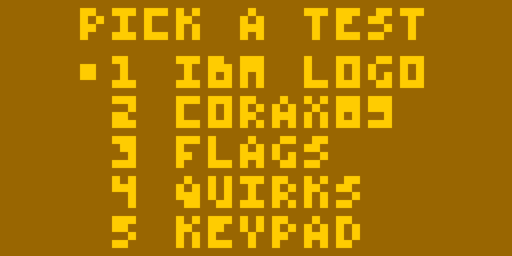
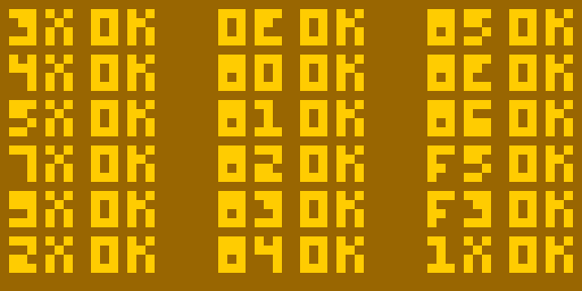

# CHIP-8 test suite

_A single ROM image containing six distinct tests that will aid you in developing
your own CHIP-8, SCHIP or XO-CHIP interpreter (or "emulator")_

* [Download the ROM here](./bin/chip8-test-suite.ch8?raw=true), give it a spin and
see if your interpreter is doing the right thing! 😄
* Or [run the test suite in Octo](https://timendus.github.io/chip8-test-suite/) to
see what it **should** be doing 🙄 (it's set to "Cosmac VIP" CHIP-8 mode)


## Table of contents

  * [Introduction](#introduction)
  * [Controls](#controls)
  * [Auto-starting a specific test](#auto-starting-a-specific-test)
  * [About the tests](#about-the-tests)
    * [CHIP-8 splash screen](#chip-8-splash-screen)
    * [IBM logo](#ibm-logo)
    * [Corax89's opcode test](#corax89s-opcode-test) (improved version)
    * [Flags test](#flags-test)
    * [Quirks test](#quirks-test)
    * [Keypad test](#keypad-test)

## Community response 😄

[](https://github.com/Timendus/chip8-test-suite/issues/1)

[](https://www.reddit.com/r/EmuDev/comments/viri5r/i_wrote_a_chip8_test_suite/idet6in/?utm_source=reddit&utm_medium=web2x&context=3)

[](https://www.reddit.com/r/EmuDev/comments/viri5r/i_wrote_a_chip8_test_suite/idt41f1/?utm_source=reddit&utm_medium=web2x&context=3)

[](https://www.reddit.com/r/EmuDev/comments/viri5r/comment/idugp4j/?utm_source=reddit&utm_medium=web2x&context=3)

## Introduction

I found it hard to find reliable sources on what is the right behaviour and what
is not, especially with the subtle differences between the original "Cosmac VIP"
CHIP-8 and the HP84's SCHIP (or "superchip"). Now that I have written and ported
a couple of interpreters as well as a few programs and games for the platform, I
thought it was time to put that knowledge into code.

If you're having issues with your interpreter, you can find help in the [EmuDev
discord channel `#chip-8`](https://discord.gg/dkmJAes). If you discover a
problem with this test ROM, feel free to file an issue or open a pull request.
It's open source, licensed under the GPLv3, and you're welcome to contribute.

## Controls

When you see the CHIP-8 splash screen, press any CHIP-8 key to get to the main
menu:



In the menu, you can press any of the numbers 1 to 5 on the CHIP-8 keypad to
jump to the corresponding test. Note that on a PC keyboard the keys `Q` and `W`
generally map to 4 and 5, not the numeric keys.

Alternatively, you can move the cursor up and down with CHIP-8 keys `E` and `F`
and select an item with `A`. On a PC keyboard those generally map to `F` and `V`
to move the cursor and `Z` to select. This feature mainly exists so people
implementing interpreters for platforms with limited input devices (like a game
controller) can map their buttons to those CHIP-8 keys and have an intuitive
interface too.

## Auto-starting a specific test

When you're repeatedly testing the same thing, if you're just starting out and
you have very few opcodes implemented, or if you're trying to automate your
tests, having to use the menu gets in the way. In that case, you can force the
ROM to immediately start a specific test by setting a magic value in RAM. It
will then skip waiting for a keypress and the menu entirely. To do so:

  1. Load the ROM file in memory at address `0x200` (`512`) like you normally do
  2. Set the specific test you wish to run by loading a value between 1 and 5 in
     memory at address `0x1FF` (`511`)
  3. Start execution of the ROM from address `0x200` like you normally do

## About the tests

### CHIP-8 splash screen

The first test is a very simple splash screen. It is very similar to the often
used IBM ROM, but it is actually a bit easier to get running. First, it doesn't
use the "add value to register" opcode (`7XNN`) and second it only draws aligned
sprites to the screen, so you don't have to shift the bits of the sprite to
align with your display buffer.

This first test can tell you if you're interpreting these opcodes properly:

  * `00E0` - Clear the screen
  * `6XNN` - Load normal register with immediate value
  * `ANNN` - Load index register with immediate value
  * `DXYN` - Draw sprite to screen (only aligned)

Run the ROM for 39 cycles to see this splash screen on the display:


### IBM logo

The first test that is in the menu is the classic IBM ROM. If the splash screen
works as expected, this test should be pretty easy to pass, but it is a rite of
passage for any CHIP-8 developer.

I did not write this ROM, it's probably decades old and I'm not sure who wrote
it so I can't really credit them. The code in this suite is a re-implementation
in Octo-mnemonics by my own hand, but it compiles to the exact same bytes as the
original.

To auto-start, load the value `1` into memory at `0x1FF`, load the ROM in memory
starting from `0x200` and start your interpreter. Run the ROM for 64 cycles to
see the IBM logo on the display.

If you can see the IBM logo on the screen, you are properly interpreting these
additional opcodes:

  * To get to the IBM logo code from the CHIP-8 splash screen:
    * `1NNN` - Jump
    * `FX65` - Load register from memory
    * `4XNN` - Skip next instruction if unequal
  * To show the IBM logo:
    * `7XNN` - Add immediate value to normal register
    * `DXYN` - Draw sprite to screen (un-aligned)


### Corax89's opcode test

This ROM is also a famous one, [written by
Corax89](https://github.com/corax89/chip8-test-rom). Many people use this ROM to
prove to themselves that their interpreter runs as it should. However, there are
a couple of [minor issues with the
ROM](https://github.com/corax89/chip8-test-rom/pulls) and Corax89 doesn't really
seem to be maintaining this ROM anymore. So I've taken the liberty to include it
in this suite, with those issues fixed and some minor cosmetic improvements.

To auto-start, load the value `2` into memory at `0x1FF`, load the ROM in memory
starting from `0x200` and start your interpreter.



The codes on the screen correspond to the functioning of these opcodes:

```
3XNN	00EE	8XY5
4XNN	8XY0	8XYE
5XY0	8XY1	8XY6
7XNN	8XY2	FX55
9XY0	8XY3	FX33
2NNN	8XY4	1NNN
```

If you see `OK`, they're at least somewhat functional in the happy path. If you
see `NO` you can be sure that you have an issue with that opcode.

### Flags test

This test is an adaptation of the [maths tests I
wrote](https://github.com/Timendus/silicon8/tree/main/tests) for my interpreter
[Silicon8](https://github.com/Timendus/silicon8). It checks to see if your math
operations function properly, but more importantly: it checks to see if you set
the flag register `vF` properly when running those opcodes. This is often an
issue as the flags are pretty unintuitive and fairly hard to debug.

To auto-start, load the value `3` into memory at `0x1FF`, load the ROM in memory
starting from `0x200` and start your interpreter. You should see something like
this:


Each code on the screen corresponds to an opcode, and shows if the output value
is correct (first checkmark), if the flag is correct (second checkmark) and if
the order in which the `vF` register is read and written to is correct (third
checkmark). If you see a cross instead of a checkmark in any of these spots, you
have an issue in your interpreter logic.

The top part (that starts with "HAPPY" for "happy path") checks the behaviour of
the following opcodes, in the case where we **don't** expect an overflow, carry
or shifted out bit:

```
HAPPY  8XY1   8XY2
8XY3   8XY4   8XY5
8XY6   8XY7   8XYE
```

* `8XY1` - `vX |= vY`
* `8XY2` - `vX &= vY`
* `8XY3` - `vX ^= vY`
* `8XY4` - `vX += vY`
* `8XY5` - `vX -= vY`
* `8XY6` - `vY >>= vX` or `vX >>= vX` depending on version
* `8XY7` - `vY =- vX`
* `8XYE` - `vY <<= vX` or `vX <<= vX` depending on version

The bottom part (that starts with "CARRY") checks behaviour of the following
opcodes, in the case that there **is** an overflow, carry or shifted out bit:

```
CARRY  8XY4   8XY5
8XY6   8XY7   8XYE
```

* `8XY4` - `vX += vY`
* `8XY5` - `vX -= vY`
* `8XY6` - `vY >>= vX` or `vX >>= vX` depending on version
* `8XY7` - `vY =- vX`
* `8XYE` - `vY <<= vX` or `vX <<= vX` depending on version

The last row (that starts with "OTHER") checks that the opcode `FX1E` properly
adds the value of register `vX` to the index register. For this test, only the
value is checked as overflow of the index register is not really defined in
CHIP-8 (and no ROMs rely on it as far as I know).

A note on the third checkmark, for the `vF` order: This basically checks to see
if something like `v0 += vF` works the same as for example `v0 += v1`. It's easy
to make the mistake of setting the `vF` register first, and then performing the
mathematical operation. If you do that, however, `vF` will not hold the right
value and your maths will be off when using that register.

### Quirks test

CHIP-8, SCHIP and XO-CHIP have subtle differences in the way they interpret the
bytecode. We often call these differences quirks. This test detects which quirks
your interpreter implements, and if those quirks match the platform you're
trying to target. This is one of the hardest parts to "get right" and often a
reason why "some games work, but some don't".

To auto-start this test, load the value `4` into memory at `0x1FF` and load the
ROM in memory starting from `0x200`. Additionally, you can also force the target
platform by loading a value between 1 and 3 into memory at the address `0x1FE`
(`510`). Otherwise the test asks you to choose one:


This menu works exactly the same as the main menu in terms of
[controls](#controls).

The test will now run through a couple of steps, which you will see on the
screen as some garbage and a bunch of smiley faces. After about two seconds, you
should see this screen:


The screen shows you if the following quirks are detected as active ("on", "off"
or "err" if inconsistent or broken) and if that matches your chosen target
platform (a checkmark or a cross).

* `vF reset` - The AND, OR and XOR opcodes (`8XY1`, `8XY2` and `8XY3`) reset the
  flags register to zero
* `Memory` - The save and load opcodes (`FX55` and `FX65`) increment the index
  register
* `Display wait` - Drawing sprites to the display waits for the vertical blank
  interrupt, limiting their speed to max 60 sprites per second
* `Clipping` - Sprites drawn at the bottom edge of the screen get clipped instead
  of wrapping around to the top of the screen
* `Shifting` - The shift opcodes (`8XY6` and `8XYE`) only operate on `vX`
  instead of storing the shifted version of `vY` in `vX`
* `Jumping` - The "jump to some address plus `v0`" instruction (`BNNN`) doesn't
  use `v0`, but `vX` instead where `X` is the highest nibble of `NNN`

Note that you need timer support for this test to run.

### Keypad test

This test allows you to test all three CHIP-8 key input opcodes.

To auto-start this test, load the value `5` into memory at `0x1FF` and load the
ROM in memory starting from `0x200`. Additionally, you can also force the target
opcode by loading a value between 1 and 3 into memory at the address `0x1FE`
(510). Otherwise the test asks you to choose one:


#### 1. `EX9E DOWN`

`EX9E` skips the next instruction if the key indicated in `vX` is currently
pressed. In the test, when you press a key, the corresponding value lights up on
the screen.


_Pressing keys 1 and 6_

#### 2. `EXA1 UP`

`EXA1` skips the next instruction if the key indicated in `vX` is currently
**not** pressed. In the test, when you are **not** pressing a key, the
corresponding value lights up on the screen.


_Pressing keys 1 and 6_

#### 3. `FX0A GETKEY`

`FX0A` waits for a key press and returns the pressed key in `vX`.

The test asks you to press a key on the CHIP-8 keypad. When you do, it checks
for two issues that are easy to accidentally introduce when implementing this
opcode. If all is well, you should be seeing a checkmark and "all good" on the
screen:


Otherwise, you can get either of these errors:

* `NOT HALTING` - Your implementation immediately returns the value of any
  currently pressed keys in `vX`, instead of halting the interpreter until a key
  is pressed (note that this needs timer support to be accurate)
* `NOT RELEASED` - Your implementation doesn't wait for the pressed key to be
  released before resuming
