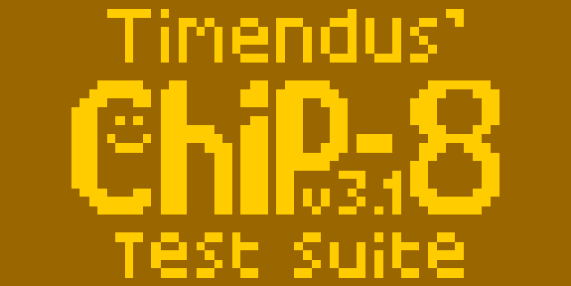
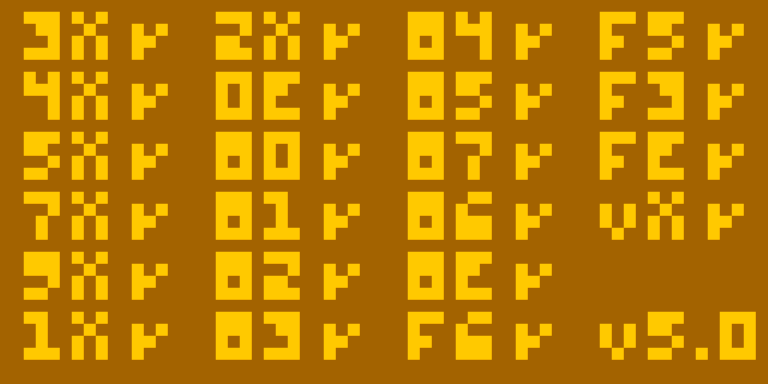
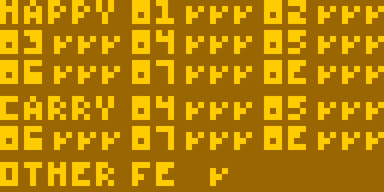
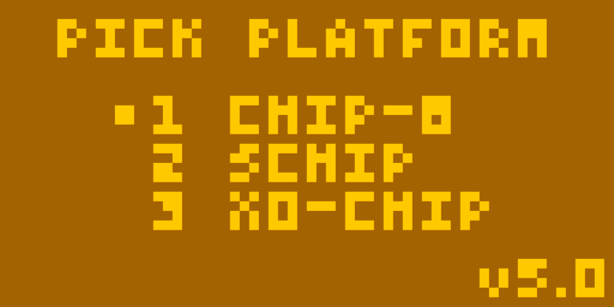
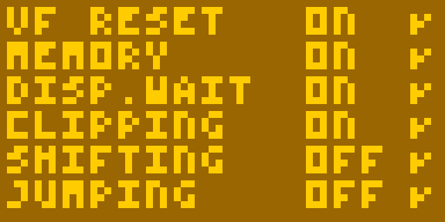
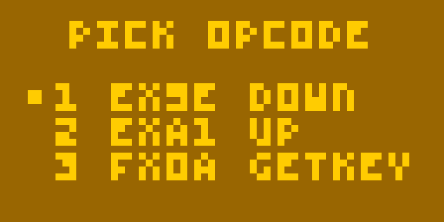
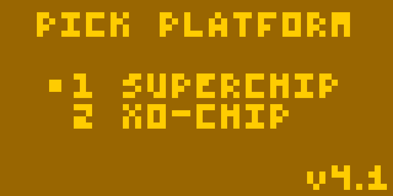
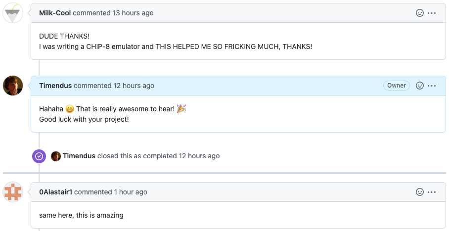
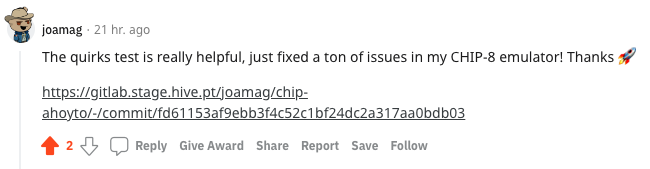

[](https://ko-fi.com/T6T0DOOWP)

# CHIP-8 test suite

_A collection of ROM images with tests that will aid you in developing your own
CHIP-8, SUPER-CHIP or XO-CHIP interpreter (or "emulator")_

## Table of contents

- [Introduction](#introduction)
- [Baseline](#baseline)
- [Available tests](#available-tests)
  - [CHIP-8 splash screen](#chip-8-splash-screen)
  - [IBM logo](#ibm-logo)
  - [Corax+ opcode test](#corax-opcode-test)
  - [Flags test](#flags-test)
  - [Quirks test](#quirks-test)
  - [Keypad test](#keypad-test)
  - [Beep test](#beep-test)
  - [Scrolling test](#scrolling-test)
- [Contributing](#contributing)
- [Community response 😄](#community-response-)

# Introduction

I found it hard to find reliable sources on what is the right behaviour and what
is not, especially with the subtle differences between the original "Cosmac VIP"
CHIP-8 and the HP48's SUPER-CHIP (or "S-CHIP"). Now that I have written and
ported a couple of interpreters as well as a few programs and games for the
platform, I thought it was time to put that knowledge into code.

If you're having issues with your interpreter, you can find help in the [EmuDev
discord channel `#chip-8`](https://discord.gg/dkmJAes). Every test has a clearly
visible version number, which will help people to diagnose your problems if you
share a screenshot. If you discover a problem with this test ROM itself, feel
free to file an issue or open a pull request. It's open source, licensed under
the GPLv3, and you're welcome to [contribute](#contributing).

# Baseline

Most tests have been written to run equally well on all three major CHIP-8
platforms, unless otherwise specified. The [quirks test](#quirks-test) is the
most interesting one, since it was designed to test the differences between
those three platforms. If the test suite itself is wrong, we're not helping
anyone. So what are we testing the test suite against?

## CHIP-8

There are several good Cosmac VIP emulators, so we can quite faithfully run the
original CHIP-8 interpreter and check the results. We use [Emma
O2](https://www.emma02.hobby-site.com/) and/or
[Cadmium](https://github.com/gulrak/cadmium) in `VIP-CHIP-8` mode to validate
the test suite.

If you have an actual, physical Cosmac VIP and would like to verify the test
suite, let me know! 😄

## SUPER-CHIP

For SUPER-CHIP, the test suite has been tested against real HP48 graphing
calculators, in the various interpreters that exist for that system.
[Gulrak](https://github.com/gulrak) from the CHIP-8 community has both an HP48SX
and an HP48GX, and has been so kind as to check if the test suite ROMs behave as
expected.

## XO-CHIP

The XO-CHIP extension was written by [John
Earnest](https://github.com/johnearnest) and was first implemented in his IDE
slash interpreter Octo. As such, we treat [Octo](http://octo-ide.com/) as the
gold standard for how an XO-CHIP system should behave, and test against that.

# Available tests

## CHIP-8 splash screen

- [Download ROM](https://github.com/Timendus/chip8-test-suite/raw/main/bin/1-chip8-logo.ch8)
  (source code available [here](./src/tests/1-chip8-logo.8o))
- [Run this ROM in Octo](https://timendus.github.io/chip8-test-suite/1-chip8-logo.html)
  to see what's supposed to happen

The first test is a very simple splash screen. It is very similar to the often
used [IBM ROM](#ibm-logo), but it is actually a bit easier to get running.
First, it doesn't use the "add value to register" opcode (`7XNN`) and second it
only draws aligned sprites to the screen (the X coordinate is always a multiple
of 8). So if you use an array of bytes for your display buffer, you don't have
to shift the bits of the sprite to align with the buffer.



Run the ROM for 39 cycles to see this splash screen on the display. This first
test can tell you if you're interpreting these opcodes properly:

- `00E0` - Clear the screen
- `6xnn` - Load normal register with immediate value
- `Annn` - Load index register with immediate value
- `Dxyn` - Draw sprite to screen (only aligned)

If you run the ROM for more than 39 cycles, it will enter an endless loop. If
that also works as expected, you've also correctly interpreted the jump opcode:

- `1nnn` - Jump

## IBM logo

- [Download ROM](https://github.com/Timendus/chip8-test-suite/raw/main/bin/2-ibm-logo.ch8)
  (source code available [here](./src/tests/2-ibm-logo.8o))
- [Run this ROM in Octo](https://timendus.github.io/chip8-test-suite/2-ibm-logo.html)
  to see what's supposed to happen

The second test is the classic IBM ROM. If the splash screen works as expected,
this test should be pretty easy to pass, but it is a rite of passage for any
CHIP-8 developer.

I did not write this ROM, it's probably decades old and I'm not sure who wrote
it so I can't really credit them. The code in this suite is a re-implementation
in Octo-mnemonics by my own hand, but it compiles to the exact same bytes as the
original (except for the version number).


Run the ROM for 20 cycles to see the IBM logo on the display. If you can see the
IBM logo, you are properly interpreting these opcodes:

- `00E0` - Clear the screen
- `6xnn` - Load normal register with immediate value
- `Annn` - Load index register with immediate value
- `7xnn` - Add immediate value to normal register
- `Dxyn` - Draw sprite to screen (un-aligned)

If you run the ROM for more than 20 cycles, it will enter an endless loop. If
that also works as expected, you've also correctly interpreted the jump opcode:

- `1nnn` - Jump

## Corax+ opcode test

- [Download ROM](https://github.com/Timendus/chip8-test-suite/raw/main/bin/3-corax+.ch8)
  (source code available [here](./src/tests/3-corax+.8o))
- [Run this ROM in Octo](https://timendus.github.io/chip8-test-suite/3-corax+.html)
  to see what's supposed to happen

This ROM is an adaptation of another famous one, the [CHIP-8 test rom written by
corax89](https://github.com/corax89/chip8-test-rom). Many people use corax89's
ROM to prove to themselves that their interpreter runs as it should. However,
there are a couple of [minor issues with the
ROM](https://github.com/corax89/chip8-test-rom/pulls) and corax89 doesn't really
seem to be maintaining this ROM anymore.

So I've taken the liberty to fix those issues, add a few new tests and make some
cosmetic changes for this test suite.

This test needs the opcodes listed above for the IBM logo as well as the
conditional skip opcodes (`3XNN`, `4XNN` and `5XY0`) to be working properly to
actually show you some sane results.



The codes on the screen correspond to the functioning of these opcodes:

```
3xnn    2nnn    8xy4    Fx55
4xnn    00EE    8xy5    Fx33
5xy0    8xy0    8xy7    Fx1E
7xnn    8xy1    8xy6    Registers
9xy0    8xy2    8xyE
1nnn    8xy3    Fx65
```

If you see a checkmark, they're at least somewhat functional in the happy path.
If you see a cross you can be sure that you have an issue with that opcode.

Here's a rough description of what these opcodes should do to pass the tests:

- `3xnn` - if `vX == nn`, skip next opcode
- `4xnn` - if `vX != nn`, skip next opcode
- `5xy0` - if `vX == vY`, skip next opcode
- `7xnn` - `vX += nn`
- `9xy0` - if `vX != vY`, skip next opcode
- `1nnn` - `jump nnn` (goto)
- `2nnn` - `call nnn` (subroutine)
- `00EE` - `return` from subroutine
- `8xy0` - `vX = vY`
- `8xy1` - `vX |= vY`
- `8xy2` - `vX &= vY`
- `8xy3` - `vX ^= vY`
- `8xy4` - `vX += vY`
- `8xy5` - `vX -= vY`
- `8xy7` - `vX = vY - vX`
- `8xy6` - `vX = vY >> 1` or `vX = vX >> 1` depending on quirks
- `8xyE` - `vX = vY << 1` or `vX = vX << 1` depending on quirks
- `Fx65` - load registers `v0` - `vX` from memory starting at `i`
- `Fx55` - save registers `v0` - `vX` to memory starting at `i`
- `Fx33` - store binary-coded decimal representation of `vX` to memory at `i`,
  `i + 1` and `i + 2`
- `Fx1E` - `i += vX`
- `Registers` - The `v0` - `vF` registers should be 8 bits wide. This tests to
  see if it can overflow your registers.

If you are having trouble figuring out how each opcode is supposed to behave,
check out [Tobias'
guide](https://tobiasvl.github.io/blog/write-a-chip-8-emulator/#instructions) or
[Gulrak's table of opcodes](https://chip8.gulrak.net) (but make sure you only check "CHIP-8" if you are just starting out).

## Flags test

- [Download ROM](https://github.com/Timendus/chip8-test-suite/raw/main/bin/4-flags.ch8)
  (source code available [here](./src/tests/4-flags.8o))
- [Run this ROM in Octo](https://timendus.github.io/chip8-test-suite/4-flags.html)
  to see what's supposed to happen

This test checks to see if your math operations function properly on some given
set of input values. But more importantly: it checks to see if you set the flag
register `vF` properly when running those opcodes, and if you don't mess up `vF`
too early (when `vF` is used as one of the operands). This is often an issue as
the flags are pretty unintuitive and fairly hard to debug.



When running this test you should see the above on your screen. Each code on the
screen corresponds to an opcode, and shows if the output value is correct (first
checkmark), if the flag in `vF` is correct (second checkmark), if `vF` can be
used as the `vY` input (third checkmark) and if `vF` can be used as the `vX`
input (fourth checkmark, where present). If you see a cross instead of a
checkmark in any of these spots, you have an issue in your interpreter logic.

First, a note on the third and fourth checkmarks: these check to see if an
instruction where `vF` is one of the operands (like `v0 += vF` / `0x80F4`) works
as expected. It's easy to make the mistake of setting the `vF` register first,
and then performing the mathematical operation. If you do that, however, `vF`
will not hold the right value anymore at calculation time and your maths will be
off when using that register as an input.

The top part (that starts with "HAPPY" for "happy path") checks the behaviour of
the following opcodes, in the case where we **don't** expect an overflow, carry
or shifted out bit:

```
HAPPY  8xy1   8xy2
8xy3   8xy4   8xy5
8xy6   8xy7   8xyE
```

- `8xy1` - `vX |= vY`
- `8xy2` - `vX &= vY`
- `8xy3` - `vX ^= vY`
- `8xy4` - `vX += vY`
- `8xy5` - `vX -= vY`
- `8xy6` - `vX = vY >> 1` or `vX = vX >> 1` depending on quirks
- `8xy7` - `vX = vY - vX`
- `8xyE` - `vX = vY << 1` or `vX = vX << 1` depending on quirks

The bottom part (that starts with "CARRY") checks behaviour of the following
opcodes, in the case that there **is** an overflow, carry or shifted out bit:

```
CARRY  8xy4   8xy5
8xy6   8xy7   8xyE
```

- `8xy4` - `vX += vY`
- `8xy5` - `vX -= vY`
- `8xy6` - `vX = vY >> 1` or `vX = vX >> 1` depending on quirks
- `8xy7` - `vX = vY - vX`
- `8xyE` - `vX = vY << 1` or `vX = vX << 1` depending on quirks

The last row (that starts with "OTHER") checks that the opcode `Fx1E` (`i +=
vX`) properly adds the value of register `vX` to the index register, first for a
regular register and then when using `vF` as the `vX` input register. For this
test, only the value is checked because overflow of the index register is not
really defined in CHIP-8 and this opcode is not supposed to influence the flag
register.

See [this article](https://laurencescotford.net/chip-8-on-the-cosmac-vip-arithmetic-and-logic-instructions/)
or [this article](https://tobiasvl.github.io/blog/write-a-chip-8-emulator/#logical-and-arithmetic-instructions)
for more information on the arithmetic operations and the flags.

## Quirks test

- [Download ROM](https://github.com/Timendus/chip8-test-suite/raw/main/bin/5-quirks.ch8)
  (source code available [here](./src/tests/5-quirks.8o))
- [Run this ROM in Octo](https://timendus.github.io/chip8-test-suite/5-quirks.html)
  to see what's supposed to happen

CHIP-8, SUPER-CHIP and XO-CHIP have subtle differences in the way they interpret
the bytecode. We often call these differences quirks. This test detects which
quirks your interpreter implements, and if those quirks match the platform
you're trying to target. This is one of the hardest parts to "get right" and
often a reason why "some games work, but some don't".

### The menu

The test asks you to choose the platform you are targeting. If you select
SUPER-CHIP, if will then also ask you if you want to test for the "modern" or
the "legacy" behaviour. When in doubt, go for the "modern" one.



You can press any of the numbers `1` to `3` on the CHIP-8 keypad to make the
corresponding selection.

Alternatively, you can move the cursor up and down with CHIP-8 keys `E` and `F`
and select an item with `A`. This feature mainly exists so people implementing
interpreters for platforms with limited input devices (like a game controller)
can map their buttons to those CHIP-8 keys and have an intuitive interface too.

If you want to repeat a test often or even automate them, having to use the
graphical menu just gets in the way. In that case, you can force this ROM to
select a specific platform by loading a value between `1` and `4` into memory at
the address `0x1FF` (`512`).

- `1` - CHIP-8
- `2` - SUPER-CHIP with modern behaviour
- `3` - XO-CHIP
- `4` - SUPER-CHIP with legacy behaviour

### The test

The test will now run through a couple of steps, which you will see on the
screen as a loading progress bar followed by some artifacts. After about three
seconds, you should see this screen:



The screen shows you if the following quirks are detected as active ("on", "off"
or an error) and if that matches your chosen target platform (a checkmark or a
cross).

- `vF reset` - The AND, OR and XOR opcodes (`8xy1`, `8xy2` and `8xy3`) reset the
  flags register to zero. Test will show `ERR1` if the AND and OR tests don't
  behave the same and `ERR2` if the AND and XOR tests don't behave the same.
- `Memory` - The save and load opcodes (`Fx55` and `Fx65`) increment the index
  register. More information [here](https://laurencescotford.net/chip-8-on-the-cosmac-vip-loading-and-saving-variables/)
  and [here](https://tobiasvl.github.io/blog/write-a-chip-8-emulator/#fx55-and-fx65-store-and-load-memory).
  Test will show `ERR1` if reading and writing don't behave the same.
- `Display wait` - Drawing sprites to the display waits for the vertical blank
  interrupt, limiting their speed to max 60 sprites per second. More information
  [here](https://laurencescotford.net/chip-8-on-the-cosmac-vip-drawing-sprites/).
  Test will show `SLOW` if the number of cycles per frame is too low for the test
  to be deterministic (this is not necessarily an error, but a suggestion to
  rerun the test with a higher number of cycles per frame).
- `Clipping` - Sprites drawn at the bottom edge of the screen get clipped
  instead of wrapping around to the top of the screen. When clipping is off, the
  test checks if sprites get rendered at the right coordinates on the other side
  of the screen. This also tests that sprites drawn at coordinates of `x > 63`
  and/or `y > 31` wrap around to `x % 64` and `y % 32`. More information
  [here](https://laurencescotford.net/chip-8-on-the-cosmac-vip-drawing-sprites/).
  Test will show `ERR1` if the clipping is inconsistent in different dimensions
  or wrapping to the wrong coordinates and `ERR2` if sprites don't wrap around
  as expected.
- `Shifting` - The shift opcodes (`8xy6` and `8xyE`) only operate on `vX`
  instead of storing the shifted version of `vY` in `vX` (more information
  [here](https://tobiasvl.github.io/blog/write-a-chip-8-emulator/#8xy6-and-8xye-shift)).
  Test will show `ERR1` if the shift opcodes behave differently.
- `Jumping` - The "jump to some address plus `v0`" instruction (`Bnnn`) doesn't
  use `v0`, but `vX` instead where `X` is the highest nibble of `nnn` (more
  information [here](https://tobiasvl.github.io/blog/write-a-chip-8-emulator/#bnnn-jump-with-offset))

Note that you need timer support for this test to run.

### SUPER-CHIP / XO-CHIP

If you select SUPER-CHIP or XO-CHIP in the menu, half of the test will be
executed in `hires` mode, and the behaviour of `Display wait` and `Clipping`
will be tested in both `lores` and `hires` modes. This means you will not just
see "on" or "off" for these quirks, but instead one of these values:

- `NONE` - The quirk is disabled in both modes
- `HRES` - The quirk is only enabled in `hires` mode
- `LRES` - The quirk is only enabled in `lores` mode
- `BOTH` - The quirk is enabled in both modes

If the test finds different errors for the `Clipping` test in `hires` mode
compared to `lores` mode, it will show `ERR3`. In that case, first make sure
your modes produce the same wrapping and clipping results, and see which errors
pop up after that.

Wondering why testing `hires` has been added, or if a quirk can ever be enabled
in only one of the modes? Or just wondering why SUPER-CHIP has a "legacy" and a
"modern" version of the test? You can [read the full story
here](./legacy-superchip.md).

### More information

See this [excellent
table](https://chip8.gulrak.net) by Gulrak for
an overview of all the known quirks for the relatively popular CHIP-8 versions.
See [this website](https://chip-8.github.io/extensions/) for a lot more
information about all the historical versions of the platform and the different
quirks among them.

## Keypad test

- [Download ROM](https://github.com/Timendus/chip8-test-suite/raw/main/bin/6-keypad.ch8)
  (source code available [here](./src/tests/6-keypad.8o))
- [Run this ROM in Octo](https://timendus.github.io/chip8-test-suite/6-keypad.html)
  to see what's supposed to happen

This test allows you to test all three CHIP-8 key input opcodes. It shows you a
little menu, asking which opcode you would like to test:



You can press any of the numbers `1` to `3` on the CHIP-8 keypad to jump to the
corresponding test.

Alternatively, you can move the cursor up and down with CHIP-8 keys `E` and `F`
and select an item with `A`. This feature mainly exists so people implementing
interpreters for platforms with limited input devices (like a game controller)
can map their buttons to those CHIP-8 keys and have an intuitive interface too.

If you want to repeat a test often or even automate them, having to use the
graphical menu just gets in the way. In that case, you can force this ROM to
select a specific platform by loading a value between `1` and `3` into memory at
the address `0x1FF` (`512`).

### 1. `Ex9E DOWN`

`Ex9E` skips the next instruction if the key indicated in `vX` is currently
pressed. In the test, when you press a key, the corresponding value lights up on
the screen.


_Pressing keys 1 and 6_

### 2. `ExA1 UP`

`ExA1` skips the next instruction if the key indicated in `vX` is currently
**not** pressed. In the test, when you are **not** pressing a key, the
corresponding value lights up on the screen.


_Pressing keys 1 and 6_

### 3. `Fx0A GETKEY`

`Fx0A` waits for a key press and returns the pressed key in `vX`.

The test asks you to press a key on the CHIP-8 keypad. When you do, it checks
for two issues that are easy to accidentally introduce when implementing this
opcode. If all is well, you should be seeing a checkmark and "all good" on the
screen:


Otherwise, you can get either of these errors:

- `NOT HALTING` - Your implementation immediately returns the value of any
  currently pressed keys in `vX`, instead of halting the interpreter until a key
  is pressed (note that this needs timer support to be accurate - in other words,
  the DELAY TIMER should continue to count down while awaiting a keypress)
- `NOT RELEASED` - Your implementation doesn't wait for the pressed key to be
  released before resuming

See [this
article](https://laurencescotford.net/chip-8-on-the-cosmac-vip-keyboard-input/)
for more information.

## Beep test

- [Download ROM](https://github.com/Timendus/chip8-test-suite/raw/main/bin/7-beep.ch8)
  (source code available [here](./src/tests/7-beep.8o))
- [Run this ROM in Octo](https://timendus.github.io/chip8-test-suite/7-beep.html)
  to see what's supposed to happen (sound may not actually play due to browser
  restrictions)

This test allows you to test if your buzzer is working. It will beep SOS in
morse code and flash a speaker icon on the display in the same pattern. If you
press the CHIP-8 button `B` it will give you manual control over the buzzer.
Press `B` to beep.


## Scrolling test

- [Download ROM](https://github.com/Timendus/chip8-test-suite/raw/main/bin/8-scrolling.ch8)
  (source code available [here](./src/tests/8-scrolling.8o))
- [Run this ROM in Octo](https://timendus.github.io/chip8-test-suite/8-scrolling.html)
  to see what's supposed to happen

This test is only applicable to SUPER-CHIP and XO-CHIP interpreters, since
regular CHIP-8 does not have scrolling instructions. It will test to see if your
scrolling opcodes scroll the display in the right directions by the right
amounts of pixels. One literal "edge"-case that it does **not** cover is what
happens at the edges of the screen.

### The menu

The test asks you to choose the platform and resolution you are targeting. For
SUPER-CHIP `lores`, it will also ask you to choose between "modern" or "legacy"
behaviour. When in doubt, go for the "modern" one.



You can press any of the numbers `1` or `2` on the CHIP-8 keypad to select the
corresponding entry.

Alternatively, you can move the cursor up and down with CHIP-8 keys `E` and `F`
and select an item with `A`. This feature mainly exists so people implementing
interpreters for platforms with limited input devices (like a game controller)
can map their buttons to those CHIP-8 keys and have an intuitive interface too.

If you want to repeat a test often or even automate them, having to use the
graphical menu just gets in the way. In that case, you can force this ROM to
select a specific platform by loading a value between `1` and `5` into memory at
the address `0x1FF` (`512`).

- `1` - SUPER-CHIP `lores` with modern behaviour
- `2` - SUPER-CHIP `lores` with legacy behaviour
- `3` - SUPER-CHIP `hires`
- `4` - XO-CHIP `lores`
- `5` - XO-CHIP `hires`

### The test

The test will show you a visual with arrows and boxes. If everything works as
expected for the target you have selected, all the arrows will end up in their
boxes, like so:


If you have issues with one or more of your scrolling instructions, some arrows
will be (partially) outside their boxes. The arrows all point in the directions
that they should be scrolled in, so the ones that have not moved in the
direction that they point in represent the scrolling instructions that are not
working properly.

For example, this is what you see if none of the scrolling instructions have
been implemented:


A note on legacy versus modern behaviour for SUPER-CHIP's `lores` mode can be
found in the document [Legacy SUPER-CHIP](./legacy-superchip.md).

# Contributing

Do you find an issue in this test suite that you think you can fix? Feel free to
submit a PR! Here's how to build the project, assuming you have Nodejs and NPM
installed:

```bash
git clone git@github.com:Timendus/chip8-test-suite.git
cd chip8-test-suite
npm install
```

```bash
# Build all the tests in `src/tests/` to `bin/`:
npm start

# Build a specific test:
TEST=1-chip8-logo npm run build-test
TEST=2-ibm-logo npm run build-test
TEST=3-corax+ npm run build-test
TEST=4-flags npm run build-test
TEST=5-quirks npm run build-test
TEST=6-keypad npm run build-test
TEST=7-scrolling npm run build-test
TEST=8-beep npm run build-test
```

Note that the `npm` scripts use the MacOS command `pbcopy` to copy
the resulting Octo source file to the clipboard. Depending on your OS this may
not work properly. Edit `package.json` and remove this part from the end of `scripts` ->
`build-test` if you get errors:

```
 && cat bin/${TEST}.8o | pbcopy
```

# Community response 😄

[](https://github.com/Timendus/chip8-test-suite/issues/1)

[](https://www.reddit.com/r/EmuDev/comments/viri5r/i_wrote_a_chip8_test_suite/idet6in/?utm_source=reddit&utm_medium=web2x&context=3)

[](https://www.reddit.com/r/EmuDev/comments/viri5r/i_wrote_a_chip8_test_suite/idt41f1/?utm_source=reddit&utm_medium=web2x&context=3)

[](https://www.reddit.com/r/EmuDev/comments/viri5r/comment/idugp4j/?utm_source=reddit&utm_medium=web2x&context=3)
