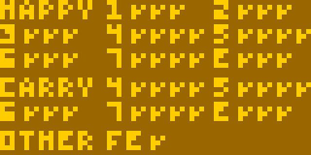

# Flags test

This test is an adaptation of the [maths tests I
wrote](https://github.com/Timendus/silicon8/tree/main/tests) for my interpreter
[Silicon8](https://github.com/Timendus/silicon8). It checks to see if your math
operations function properly, but more importantly: it checks to see if you set
the flag register `vF` properly when running those opcodes, and if you don't
mess up `vF` too early (when used as an input) when doing so. This is often an
issue as the flags are pretty unintuitive and fairly hard to debug.

To auto-start, load the value `3` into memory at `0x1FF`, load the ROM in memory
starting from `0x200` and start your interpreter. You should see something like
this:



Each code on the screen corresponds to an opcode, and shows if the output value
is correct (first checkmark), if the flag is correct (second checkmark) and if
the order in which the `vF` register is read and written to is correct (third
checkmark). If you see a cross instead of a checkmark in any of these spots, you
have an issue in your interpreter logic.

The top part (that starts with "HAPPY" for "happy path") checks the behaviour of
the following opcodes, in the case where we **don't** expect an overflow, carry
or shifted out bit:

```
HAPPY  8XY1   8XY2
8XY3   8XY4   8XY5
8XY6   8XY7   8XYE
```

* `8XY1` - `vX |= vY`
* `8XY2` - `vX &= vY`
* `8XY3` - `vX ^= vY`
* `8XY4` - `vX += vY`
* `8XY5` - `vX -= vY`
* `8XY6` - `vY >>= vX` or `vX >>= vX` depending on version
* `8XY7` - `vY =- vX`
* `8XYE` - `vY <<= vX` or `vX <<= vX` depending on version

The bottom part (that starts with "CARRY") checks behaviour of the following
opcodes, in the case that there **is** an overflow, carry or shifted out bit:

```
CARRY  8XY4   8XY5
8XY6   8XY7   8XYE
```

* `8XY4` - `vX += vY`
* `8XY5` - `vX -= vY`
* `8XY6` - `vY >>= vX` or `vX >>= vX` depending on version
* `8XY7` - `vY =- vX`
* `8XYE` - `vY <<= vX` or `vX <<= vX` depending on version

The last row (that starts with "OTHER") checks that the opcode `FX1E` properly
adds the value of register `vX` to the index register. For this test, only the
value is checked as overflow of the index register is not really defined in
CHIP-8 (and no ROMs rely on it as far as I know).

A note on the third checkmark, for the `vF` order: This basically checks to see
if something like `v0 += vF` works as expected (the value of `vF` gets added to
`v0`). It's easy to make the mistake of setting the `vF` register first, and
then performing the mathematical operation. If you do that, however, `vF` will
not hold the right value anymore and your maths will be off when using that
register for any calculations.

See [this article](https://laurencescotford.com/chip-8-on-the-cosmac-vip-arithmetic-and-logic-instructions/)
or [this article](https://tobiasvl.github.io/blog/write-a-chip-8-emulator/#logical-and-arithmetic-instructions)
for more information on the arithmetic operations and the flags.
