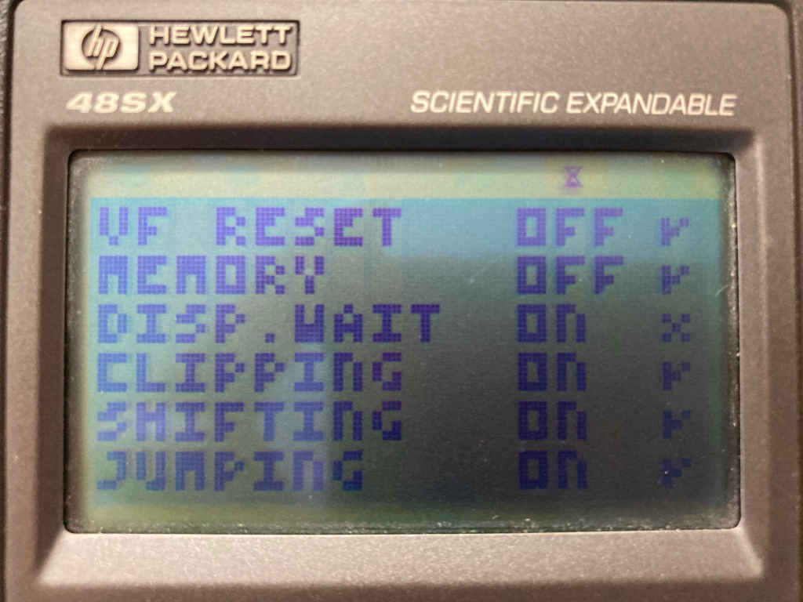
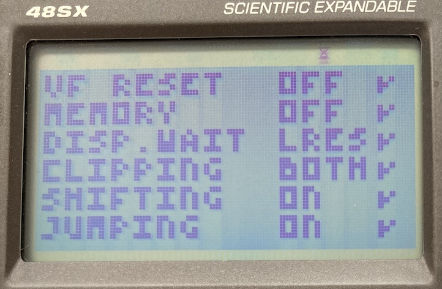
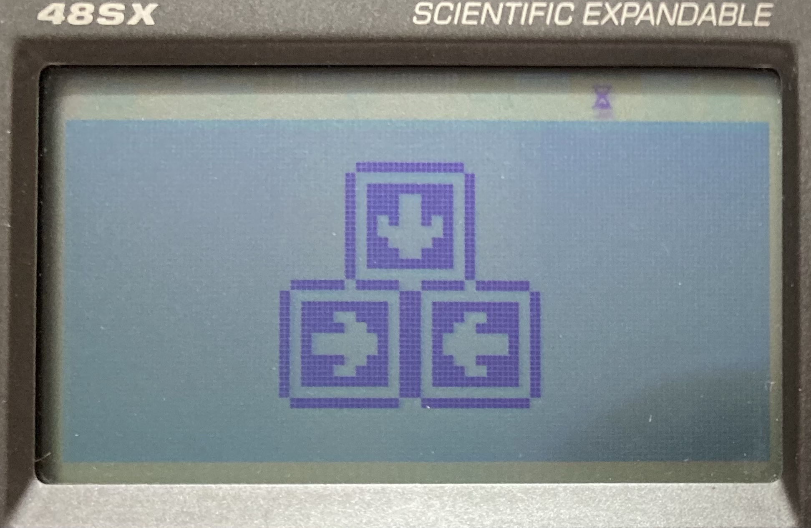

# Legacy SUPER-CHIP

When CHIP-8 was ported to the HP48 graphical calculators in the nineties, many
mistakes were made. The CHIP48 and SUPER-CHIP interpreters introduced all kinds
of larger and smaller differences with the original Cosmac VIP interpreter that
we have kindly come to call "quirks".

But later developers trying to replicate the unusual behaviours of SUPER-CHIP
have themselves also introduced new discrepancies. SUPER-CHIP used to work quite
a bit different on those HP48 calculators than most modern "SUPER-CHIP" capable
interpreters do these days.

So different in fact, that for the purpose of this test suite we've had to split
SUPER-CHIP in a "legacy" and a "modern" flavour. Because ROMs written for
SUPER-CHIP interpreters that don't actually run on an HP calculator depend on
the modern behaviour, even though that is techically "wrong".

The good news for interpreter developers is that most known ROMs that have been
written for the legacy interpreters also run fine in the modern version of
SUPER-CHIP. So if being able to run ROMs is what you care about, you will get
99% of the way there by just implementing the modern version.

If you like a challenge though, this document will describe the differences
between modern SUPER-CHIP interpreters and the original ones — at least those
that this test suite is actually capable of testing.

## The "display wait" quirk

The `Display wait` quirk from the quirks test works different in legacy
SUPER-CHIP mode. Why is that? It has to do with how SUPER-CHIP low resolution
mode works, and a feature of that mode that's long been overlooked.

### The "hidden feature" of `lores` mode

We've all come to know the high and low resolution modes of SUPER-CHIP as
`hires` and `lores`, thanks to the instructions with those same names in Octo
and the descriptions of these opcodes in various sources. However, in [the
original description](https://groups.google.com/g/comp.sys.handhelds/c/fPUzuAkDdVs?pli=1)
of SUPER-CHIP's opcodes, the author Erik Bryntse calls `hires` "extended screen
mode" and describes that it is used for "enabling **higher speed** and full
screen (64x128) resolution" (emphasis mine).

So `lores` mode, being the inverse of that, uses the lower resolution and also
_restricts the speed of the interpreter_ to 60 sprites drawn per second
(technically maybe 64, but let's not go there now 😉).

[Gulrak](https://github.com/gulrak) discovered this when running the test suite
on his HP48SX and HP48GX calculators, with the original SUPER-CHIP interpreter,
and not passing the SUPER-CHIP quirks test:

It works this way with the SUPER-CHIP 1.0 and SUPER-CHIP 1.1 interpreters, and
on multiple devices, so it's definitely a feature, not a bug.

Probably a better way to describe `lores` mode would be "compatibility mode", as
SUPER-CHIP tries to be compatible (at least in the way of resolution and speed)
with the original Cosmac VIP interpreter in this mode.

Since the test suite ran entirely in `lores` mode before version 4.1, it
accidentally triggered the "compatibility mode" of SUPER-CHIP and enabled the
`Display wait` quirk in the interpreter. The test would then report an error,
because SUPER-CHIP wasn't supposed to have `Display wait` enabled, according
to conventional wisdom.

### Fixing the problem

After discovering this issue, I could not possibly pretend that the quirks test
of the test suite was correct for SUPER-CHIP, since it gave an error on the
original platform. So I decided to extend the quirks test by running the
`Display wait` and `Clipping` tests in both `lores` and `hires` modes.

For legacy SUPER-CHIP, it now expects the `Display wait` quirk to be enabled in
`lores` mode and to be disabled in `hires` mode. Otherwise, the test will fail.
For modern SUPER-CHIP it still expects the `Display wait` quirk to be disabled
in both modes. The `Clipping` quirk, it turns out, should be enabled in all
cases.

This gives us the expected result with the SUPER-CHIP 1.0 and 1.1 interpreters
on the original hardware:

## The scrolling test

When you run the scrolling test and select legacy SUPER-CHIP and `lores`, it
will probably show a pretty messed up image if you haven't explicitly developed
your interpreter to handle that case. What's the deal with that?

### How a design flaw morphed over time

Since the HP48 calculators had exactly twice the resolution of CHIP-8, the
original interpreters for the platform implemented `lores` such that each pixel
was 2x2 physical pixels. This was an easy trick to make the low resolution
CHIP-8 screen fill up the entire display of the calculator.

When the scrolling instructions were added with the release of SUPER-CHIP 1.1,
they were not really intended to be used by the boring old original CHIP-8 ROMs.
Only fancy new SUPER-CHIP ROMs, intended for the calculator, would even know
those existed! So when those opcodes were implemented for SUPER-CHIP, the author
probably only expected people to use those new opcodes in "Extended screen
mode", which allows the developer to use all the pixels of the calculator's
screen, which we now know as `hires` mode. Because why wouldn't you want to use
all available pixels?

So the author probably didn't really consider what would happen if ROMs would
use the scrolling instructions when in `lores` "compatibility" mode. He
implemented scrolling to operate on the physical pixels of the device, but still
allowed `lores` ROMs to use the opcodes. Which means that in `lores` mode
scrolling happens per "half pixel". This behaviour is what the "legacy" version
of the test is intended for:

However, modern interpreter developers reading the SUPER-CHIP spec (but not
having an HP calculator available for testing) implemented the "modern" version
of the opcodes, in the way most people would expect: scrolling one pixel just
scrolls one pixel, independent of wether you are in `hires` or `lores` mode.
When [Octo](http://octo-ide.com) came out, if followed suit. And thanks to the
awesome yearly Octojam game jams, people have been writing brand new SUPER-CHIP
games in the last couple of years, including `lores` ROMs that expect single
pixel scrolling.

So even though scrolling per whole pixel is technically "wrong" for `lores`
SUPER-CHIP, most `lores` games that use scrolling depend on this "modern"
interpretation of the opcodes. There are almost no ROMs that depend on the
legacy version.

## Tip of the iceberg

These are just two "features" of SUPER-CHIP that have pretty much been "lost"
over time that we've run into when developing this test suite. I'm aware that
there are more, but that's for a later time. And there are probably more issues
that I'm not yet aware of.

One of the secret goals of this test suite is to keep the CHIP-8 interpreters in
our community from diverging even further. Every interpreter that _tries_ to be
compatible but accidentally introduces a new incompatibility, and then has ROMs
written for it, fragments the space further. Making CHIP-8 development even
harder for future generations trying to run those ROMs.

That's why we need to discover and document these things properly, and write
easy to run and easy to interpret tests for all those new people coming to the
platform every week, and for those who simply don't have access to the original
systems.

